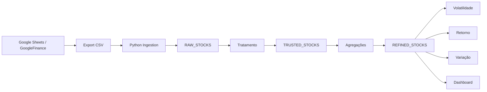

# Stock Market Data Pipeline & Analysis

## Visão Geral

Este projeto implementa um pipeline de dados para análise de ações brasileiras, utilizando dados provenientes do Google Finance.

A solução simula um cenário real de engenharia de dados, estruturando informações de mercado em camadas e gerando métricas analíticas relevantes como retorno e volatilidade.

---

## Objetivo

Construir um fluxo completo de dados para:

* Coleta de dados de mercado
* Armazenamento estruturado
* Transformação analítica
* Geração de insights financeiros

---

## Arquitetura

---

## Camadas de Dados

### RAW

Dados brutos exportados do Google Finance contendo:

* Ticker
* Data
* Preço (Open, High, Low, Close)
* Volume

---

### TRUSTED

Camada de padronização e limpeza:

* Conversão de tipos
* Ordenação temporal
* Validação de dados

---

### REFINED

Camada analítica com métricas de mercado:

#### Retorno

* Retorno acumulado por ativo

#### Volatilidade

* Desvio padrão dos retornos
* Indicador de risco

#### Variação diária

* Percentual de mudança entre dias consecutivos

---

## Principais Análises

* Ranking de performance entre ativos
* Identificação de ativos mais voláteis
* Comparação entre setores
* Relação entre volume e preço

---

## Tecnologias Utilizadas

* Python (Pandas)
* SQL (Oracle)
* Google Sheets (GoogleFinance)
* Modelagem de dados

---

## Insights Gerados

* Ativos com maior retorno no período analisado
* Identificação de padrões de volatilidade
* Relação entre liquidez e variação de preço
* Comportamento histórico dos ativos

---

## 👨‍💻 Autor

Projeto desenvolvido com foco em simular um pipeline de dados financeiro completo, integrando engenharia e análise para geração de valor.
